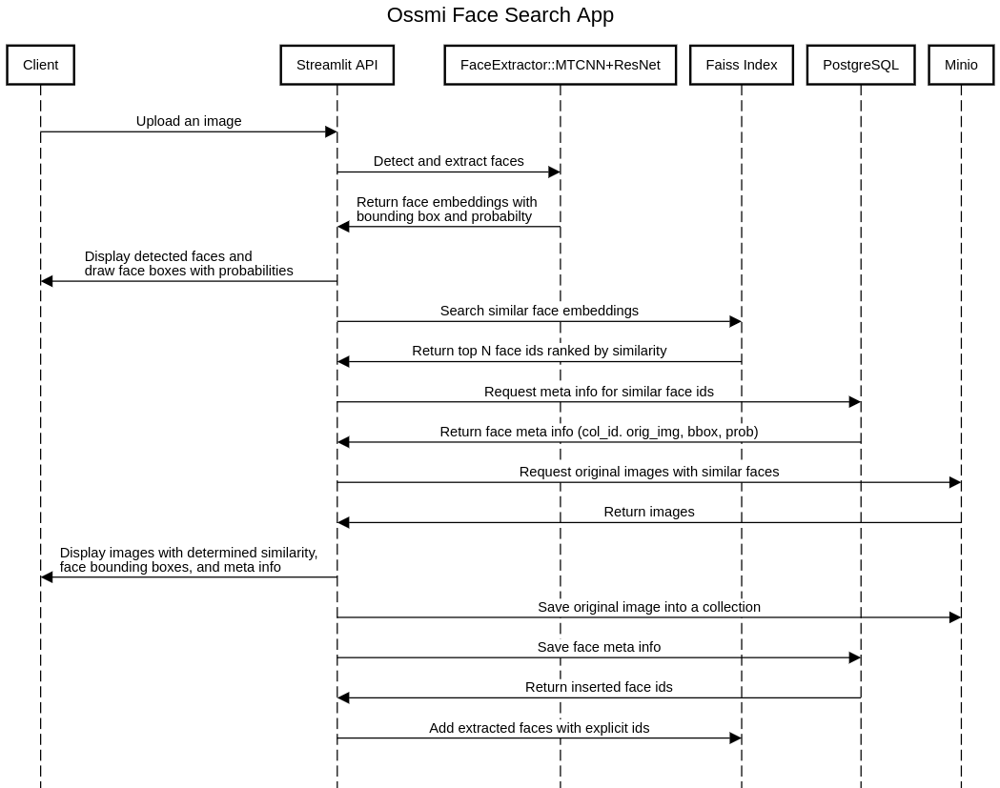

## Ossmi. An Interactive Face Search App

 Standalone (web or mobile) personal photo gallery with face recognition. 
_Google Photos на минималках?_

- Dynamically indexing faces from newly uploaded photos
- Searching photos of a person within a gallery by leveraging indexed faces
- Annotating/naming persons (face_ids)


#### Sequence Diagram


#### Face Indexing Pipeline


##### Todo:
* Dynamically update indexes with new images
* Automate the creation of new collections and indexes
* More data: collect more images from kipyatcom, ppz, vk
* Consider using VGGFace2 for demo?
* Fine tune the Inceptionesnet v1 on a new dataset
* Analyze model performance, choose optimal distance metric (Euclidean and Cosine)
* Tune and evaluate faiss indexing
* Data Visualization. Analyze outliers
* Data Augmentation


* Publish on Heroku, AWS, GCP? 
* Testing
* Documentation
* Write a blog on how to use the app?
* Publish on ProductHunt?

**Usage**
 
1. Install streamlit: `python3 -m pip install streamlit`

2. Run the app: `streamlit run main.py`


Minio

```
docker run -d -p 9000:9000 -e MINIO_ACCESS_KEY=minioadmin -e MINIO_SECRET_KEY=minioadmin -v /mnt/data:/data minio/minio server /data
```

PostgreSQL

```
docker run --name ossmi -e POSTGRES_PASSWORD=postgres -d -p 15432:5432 -v pgdata:/var/lib/postgresql/data postgres
```
Connecting to aws ec2 instance
```
ssh -i mtcnn_streamlit.pem ubuntu@ec2-35-155-200-213.us-west-2.compute.amazonaws.com
```